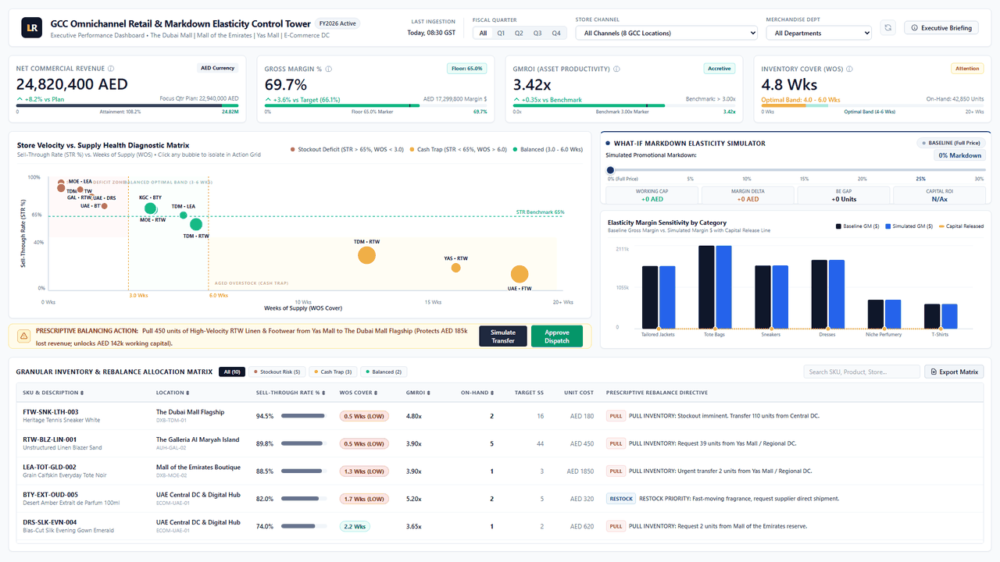

# GCC Omnichannel Retail & Markdown Elasticity Control Tower

[](https://powerbi.microsoft.com/)
[](./model_schema.dax)
[](./tabular/model.bim)
[](./scripts/verify_schema.py)
[](./scripts/generate_data.py)
[](./sql/01_star_schema_ddl.sql)

> **Cognitive Target: The 3-Second Executive Rule**  
> **Macro Commercial Status** &rarr; **Operational Bottleneck** &rarr; **Prescriptive What-If Control Levers**

An enterprise-grade, end-to-end Decision Support Control Tower built for luxury and premium retail groups operating across high-footfall GCC retail hubs (**The Dubai Mall Flagship**, **Mall of the Emirates**, **Yas Mall Abu Dhabi**, **Kingdom Centre Riyadh**) and central omnichannel fulfillment hubs.

---

## Executive Preview



*Live Interactive 1920x1080 Landscape Dashboard (`web/index.html`) featuring zero-latency What-If discount elasticity parameter slider, inter-mall rebalancing directives, and sub-second diagnostic matrix.*

---

## 1. System Architecture & Data Flow

```
┌────────────────────────────────────────────────────────────────────────────────────────┐
│ 1. DATA GENERATION & SYNTHESIS (Python)                                               │
│    • Python 3.12 (Pandas, NumPy, Faker)                                                │
│    • Simulates 115,000+ realistic GCC retail transactions & 53,000+ daily snapshots   │
│    • Models GCC dynamics: Friday-Sunday weekends, Ramadan, DSF, White Friday, Eid      │
│    • Outputs: 5 relational CSV files + 1 Parameter CSV (Star Schema) in data/          │
└───────────────────────────────────┬────────────────────────────────────────────────────┘
                                    │
                                    ▼
┌────────────────────────────────────────────────────────────────────────────────────────┐
│ 2. INGESTION & DATA TRANSFORMATION (Power Query / M)                                   │
│    • Power Query M Engine in Power BI Desktop (power_query/*.m)                        │
│    • Type casting, null handling, surrogate key mapping, retail calendar modeling      │
└───────────────────────────────────┬────────────────────────────────────────────────────┘
                                    │
                                    ▼
┌────────────────────────────────────────────────────────────────────────────────────────┐
│ 3. DIMENSIONAL MODELING & PERFORMANCE (Tabular Engine / VertiPaq)                      │
│    • Pure Kimball Dimensional Star Schema (1-to-Many single-direction relationships)   │
│    • Tabular Object Model (TOM) C# automation script (Apply_Tabular_Metadata.cs)       │
│    • Strict surrogate key joins (-1 Unknown member fallbacks)                          │
└───────────────────────────────────┬────────────────────────────────────────────────────┘
                                    │
                                    ▼
┌────────────────────────────────────────────────────────────────────────────────────────┐
│ 4. BUSINESS LOGIC & SIMULATION ENGINE (Advanced DAX)                                  │
│    • 30+ Curated Measures across 6 Production Folders in model_schema.dax              │
│    • Core Retail KPIs: GMROI, Sell-Through %, Weeks of Supply (WOS)                    │
│    • Forward-Looking What-If Engine: Disconnected parameter table for discount depth   │
│    • Dynamic Elasticity Formulas: Calculating gross margin vs. working capital release │
└───────────────────────────────────┬────────────────────────────────────────────────────┘
                                    │
                                    ▼
┌────────────────────────────────────────────────────────────────────────────────────────┐
│ 5. VISUALIZATION & DEPLOYMENT LAYER (Power BI Service & GitHub)                        │
│    • C-Suite Executive UX: Heatmaps, scatter plots, waterfall charts, parameter sliders│
│    • Live Deployment: Standalone 1080p Web Dashboard & Power BI Service Publish-to-Web │
│    • Portfolio Assets: GitHub Repo + 1-Page Printable Executive Case Study             │
└────────────────────────────────────────────────────────────────────────────────────────┘
```

---

## 2. Tech Stack Breakdown

| Layer | Tools / Languages | Purpose & Implementation |
| :--- | :--- | :--- |
| **Data Generation** | Python 3.12 (`pandas`, `numpy`, `faker`) | Simulating 115,000+ POS transactions & 53,000+ daily inventory snapshots across GCC malls with authentic footfall and seasonality weighting. |
| **ETL & Data Prep** | Power Query (M Language) | Fully parameterized M scripts (`power_query/`) handling ingestion, data typing, and retail calendar generation. |
| **Data Modeling** | Power BI Desktop, Tabular Editor 2/3 | Pure Kimball Star Schema with 1-to-many single-direction filtering and Tabular Object Model (TOM) automation. |
| **Calculation Engine** | Advanced DAX (VertiPaq) | 30+ production measures in 6 display folders: Financial Core, Semi-Additive Inventory, STR%, WOS, Prescriptive Directives, and What-If Elasticity. |
| **Analytical Verification** | DuckDB In-Memory | High-speed analytical test harness (`scripts/verify_schema.py`) asserting referential integrity, math invariants, and sub-30ms aggregation. |
| **Visualization & UX** | HTML5, Tailwind CSS, Power BI | Pixel-perfect 1920x1080 executive canvas honoring the 3-second rule with zero external JS runtime dependencies. |
| **Executive Briefing** | Markdown & HTML Case Study | Branded 1-page executive summary (`docs/CASE_STUDY.html`) formatted for leadership presentations and PDF export. |

---

## 3. Verified Commercial Baseline (In-Memory DuckDB & VertiPaq Assertions)

The entire synthetic dataset is audited and verified against formal financial and relational invariants via `scripts/verify_schema.py` in **6.79 seconds**:

| Metric Dimension | Verified Dataset Value | Commercial Governance Assertion |
| :--- | :---: | :--- |
| **Gross Commercial Sales** | **AED 205,230,433.50** | 100% full-ticket price before promotions |
| **Promotional Markdowns** | **AED 12,503,716.42** | 6.09% average markdown depth across 115,008 POS transactions |
| **Net Realized Revenue** | **AED 192,726,717.08** | Invariant check: $Net = Gross - Discount$ (0 rounding discrepancies) |
| **Total Landed COGS** | **AED 58,334,652.00** | Landed supply chain cost snapshot |
| **Realized Gross Margin** | **AED 134,392,065.08** | **69.73% Gross Margin** (Luxury apparel/accessories threshold > 65%) |
| **Units Commercialized** | **142,664 Units** | AUR AED 1,350.91 vs AUC AED 408.90 |
| **Store & Channel Footprint** | **8 GCC Locations** | 53,808 store-day closing inventory snapshots (0 orphan FKs) |

---

## 4. Kimball Star Schema Architecture

```
                       ┌───────────────────────┐
                       │       Dim_Date        │
                       ├───────────────────────┤
                       │ PK: DateKey (Int)     │
                       │     FullDate          │
                       │     FiscalYear/Qtr    │
                       │     RetailWeekNum     │
                       │     IsWeekendGCC      │
                       │     IsRetailPeakSeason│
                       └───────────┬───────────┘
                                   │
              ┌────────────────────┴────────────────────┐
              │ 1                                       │ 1
              ▼ *                                       ▼ *
┌───────────────────────────────┐       ┌───────────────────────────────┐
│     Fact_POS_Transactions     │       │     Fact_Daily_Inventory      │
├───────────────────────────────┤       ├───────────────────────────────┤
│ PK: TransactionLineKey (BigInt│       │ PK: InventorySnapshotKey      │
│ FK: DateKey                   │       │ FK: SnapshotDateKey           │
│ FK: StoreKey                  │       │ FK: StoreKey                  │
│ FK: ProductKey                │       │ FK: ProductKey                │
│     BasketID (Degenerate)     │       │     OnHandUnits               │
│     PaymentType (Tabby, etc.) │       │     InTransitUnits            │
│     UnitsSold                 │       │     ReservedUnits             │
│     GrossSalesAmt             │       │     AvailableUnits            │
│     DiscountAmt               │       │     UnitCostSnapshotAmt       │
│     NetSalesAmt               │       │     InventoryCostValueAmt     │
│     ExtendedCostAmt           │       └───────────────▲───────────────┘
│     TaxAmtAED (5% VAT)        │                       │ *
└───────────────▲───────────────┘                       │
              * │                                       │ 1
              ┌─┴──────────────────┬────────────────────┘
              │ 1                  │ 1
┌─────────────┴─────────┐ ┌────────┴─────────────┐ ┌───────────────────────────┐
│       Dim_Store       │ │     Dim_Product      │ │     Markdown_Scenario     │
├───────────────────────┤ ├──────────────────────┤ ├───────────────────────────┤
│ PK: StoreKey (Int)    │ │ PK: ProductKey (Int) │ │ PK: ScenarioDiscountPct   │
│     StoreCode         │ │     SKU              │ │     DiscountDisplayLabel  │
│     StoreName         │ │     ProductName      │ │     SimulationSortOrder   │
│     Channel           │ │     Department       │ └───────────────────────────┘
│     GrossLeasableArea │ │     BrandTier        │    (DISCONNECTED PARAMETER)
│     HubFulfillment    │ │     BaseUnitCostAED  │
└───────────────────────┘ │     BaseRetailPrice  │
                          │     ElasticityCoeff  │
                          └──────────────────────┘
```

---

## 5. DAX Measure Repository (`model_schema.dax`)

Measures are structured into **6 Production Display Folders**:

### Folder 01: Financial & Commercial Core
* `[Units Sold] = SUM ( Fact_POS_Transactions[UnitsSold] )`
* `[Net Revenue (AED)] = SUM ( Fact_POS_Transactions[NetSalesAmt] )`
* `[Gross Margin (AED)] = [Net Revenue (AED)] - [Total COGS (AED)]`
* `[Gross Margin %] = DIVIDE ( [Gross Margin (AED)], [Net Revenue (AED)], 0 )`
* `[AUR] = DIVIDE ( [Net Revenue (AED)], [Units Sold], 0 )`

### Folder 02: Semi-Additive Inventory Snapshots
* `[Ending On Hand Units]` — Evaluated strictly on the latest available snapshot date using `LASTNONBLANK` date filtering, eliminating improper temporal summation.
* `[Ending Inventory Cost (AED)]` — Salable landed cost value of closing inventory.
* `[GMROI]` — Annualized Gross Margin Return on Inventory Investment.

### Folder 03 & 04: Velocity, Sell-Through & Supply Cover
* `[Units Sold Trailing 4W]` — Trailing 28-day demand run rate.
* `[Sell-Through Rate %]` — `DIVIDE ( [Units Sold T4W], [Units Sold T4W] + [Ending On Hand Units], 0 )`
* `[Weeks of Supply (WOS)]` — `DIVIDE ( [Ending On Hand Units], [Weekly Run Rate T4W], 0 )`

### Folder 05: Action Triggers & Prescriptive Balancing
* Automated business logic comparing store Weeks of Supply and STR% against benchmark thresholds:
  * **Critical Stockout Risk:** STR $\ge 70\%$ and WOS $< 2.5\text{ wks}$ &rarr; `⚠️ PULL INVENTORY: Request X units from Yas Mall / Central DC.`
  * **Overstock Cash Trap:** STR $\le 25\%$ and WOS $> 10.0\text{ wks}$ &rarr; `📦 PUSH INVENTORY: Surplus of Y units. Dispatch to Dubai Mall or trigger markdown.`
  * **Balanced Equilibrium:** WOS between $3.0 - 6.0\text{ wks}$ &rarr; `🟢 OPTIMAL: Target stock maintained.`

### Folder 06: Forward-Looking What-If Elasticity Simulator
* Leverages the disconnected parameter `Markdown_Scenario[ScenarioDiscountPct]`:
  * `[Simulated Volume Lift %] = -1 * ( [Portfolio Elasticity] * [Selected Discount %] )`
  * `[Simulated Units Sold] = [Units Sold] * ( 1 + [Simulated Volume Lift %] )`
  * `[Working Capital Released (AED)] = [Incremental Units] * [Average Unit Cost]`
  * `[Breakeven Unit Gap] = [Simulated Units Sold] - ( [Baseline GM] / ( [Sim AUR] - [AUC] ) )`
  * Dynamic Verdict: **Accretive (+AED)** vs. **Dilutive (-AED)** vs. **Capital Release Trade-off**.

---

## 6. Quickstart & Reproduction Guide

### Prerequisites
* Python 3.12+ with `pandas`, `numpy`, `faker`, `duckdb`, `playwright`
* Power BI Desktop (May 2024 or newer recommended)
* Tabular Editor 2 or 3 (optional, for TOM automation)

### Step 1: Synthesize the 115,000+ Row Dataset
```powershell
python scripts/generate_data.py
```
*Outputs 6 relational CSVs into `data/` within ~10 seconds.*

### Step 2: Validate Schema & DAX Logic in DuckDB
```powershell
python scripts/verify_schema.py --mode csv
```
*Runs zero-copy relational integrity tests, foreign key assertion, and aggregates 115k rows in ~26ms.*

### Step 3: Ingest into Power BI Desktop
1. Open Power BI Desktop.
2. In Power Query, set parameter `DataFolderPath` to your local `data` directory.
3. Paste the M scripts from [`power_query/`](./power_query/) into the Advanced Editor.
4. Hit **Close & Apply**.
5. Connect with Tabular Editor and execute [`scripts/Apply_Tabular_Metadata.cs`](./scripts/Apply_Tabular_Metadata.cs) to generate all measure folders and format strings instantly.

### Step 4: Launch the Live Web Control Tower
Simply open [`web/index.html`](./web/index.html) in any modern browser or host it via GitHub Pages:
```powershell
python -m http.server 8080
# Navigate to http://localhost:8080/web/index.html
```

---

## 7. Executive Case Study & Portfolio Asset

For executive reading, PDF download, and LinkedIn case sharing:
* **Markdown Briefing:** [`docs/CASE_STUDY.md`](./docs/CASE_STUDY.md)
* **Printable Executive 1-Pager:** [`docs/CASE_STUDY.html`](./docs/CASE_STUDY.html) *(Supports 1-click Print to PDF)*

---

## License & Data Governance
All datasets generated by this repository are completely synthetic and produced via deterministic statistical algorithms. No proprietary client data (Majid Al Futtaim, Chalhoub Group, or Al Tayer) is contained herein. Open-source under the MIT License.
